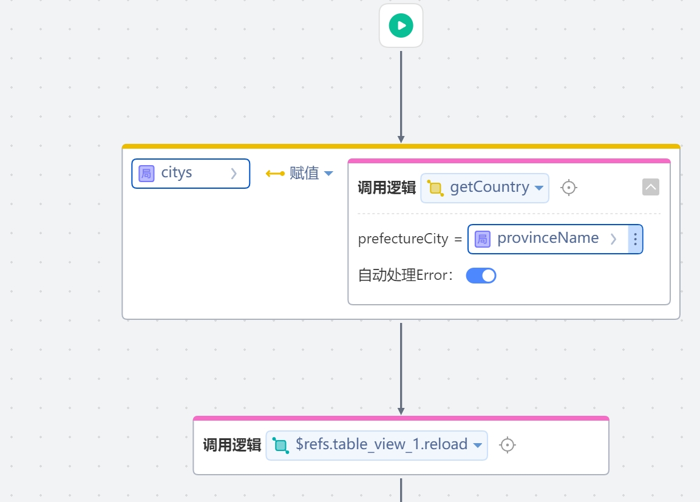

行政区依赖库

本依赖库封装了一些常用的行政区方法

## 逻辑详情

### 逻辑一 getPrefectureCity
提供输入省份，给出其地级市列表
入参：String 省份名，例如：浙江省
出参：List<Region>
citycode:城市编码，adcode:区域编码，name:行政区名称,zipCode:邮编,center:区域中心点,
level:行政区划级别(country:国家,province:省份（直辖市会在province显示）,city:市（直辖市会在province显示）, district:区县,street:街道)
districts:下级行政区列表，包含district元素
          

### 逻辑二 getCountry
提供输入地级市，给出其区县列表
入参：String 地级市名，例如：杭州市
出参：List<Region>
citycode:城市编码，adcode:区域编码，name:行政区名称,zipCode:邮编,center:区域中心点,
level:行政区划级别(country:国家,province:省份（直辖市会在province显示）,city:市（直辖市会在province显示）, district:区县,street:街道)
districts:下级行政区列表，包含district元素

### 逻辑三 estimateProvinceAndCity
提供输入省份和地级市,判断两者是否有所属关系
入参：String 省份名，例如：浙江省,String 地级市名，例如：杭州市
出参: boolean true代表存在所属关系  false代表不存在所属关系

### 逻辑四 estimateCityAndCounty
提供输入地级市和区县，判断两者是否有所属关系
入参：String 地级市名，例如：杭州市,String 区县名，例如：滨江区
出参: boolean true代表存在所属关系  false代表不存在所属关系

### 逻辑五 estimateProvinceAndCounty
提供输入省份和区县，判断两者是否有所属关系
入参：String 省份名，例如：浙江省,String 区县名，例如：滨江区
出参: boolean true代表存在所属关系  false代表不存在所属关系

### 逻辑六 getRegion
获取现有的行政区信息
出参：Region
citycode:城市编码，adcode:区域编码，name:行政区名称,zipCode:邮编,center:区域中心点,
level:行政区划级别(country:国家,province:省份（直辖市会在province显示）,city:市（直辖市会在province显示）, district:区县,street:街道)
districts:下级行政区列表，包含district元素

如果要更新行政区数据可以先调用getRegion(),获取现有的行政区信息，在此基础上修改，然后在应用可视化中心点击更多-》应用配置填入 region.jsonFileUrl的值，
依赖库会自动从指定的url中获取最新行政区的json信息

## 使用步骤说明

1.  应用引用依赖库
2.  配置应用配置参数（如果有的话）
3.  逻辑调用示例截图
4.  
5.   

## 应用演示链接

[使用了本依赖库的制品应用链接]
